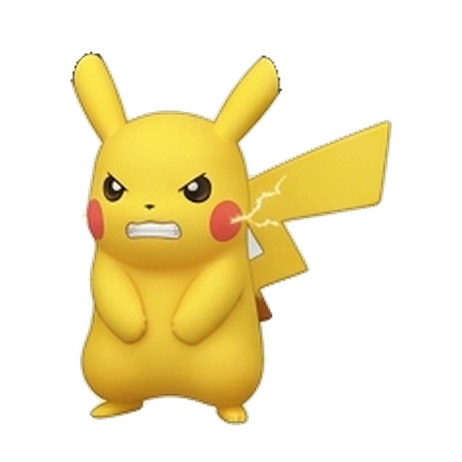
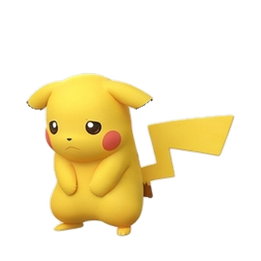

# ⚡ Pocket Pikachu

*A Pokémon you can actually talk to, running 100% on your own machine.*

<p align="center"></p>

Say hi to Pocket Pikachu: a little desktop buddy you chat with by voice, and every single word of it runs right there on your laptop. No cloud, no API keys, no internet needed. Yank the WiFi out and it happily keeps listening, thinking, and talking back. It greets you in the morning, asks how you're doing, nudges you to drink water, learns your daily rhythm, and even helps you practice a new language. All of it runs on a stack of tiny open-weight models small enough to live on a laptop.

> **Build Small, in one line:** the whole brain, voice, and ears loop is three open models, each 1B parameters or smaller, all running locally. Take the network away and nothing breaks. That's the whole point. ⚡

### 🔗 See it in action

- 🎬 **Demo video:** [Watch on YouTube](https://youtu.be/MAsgEj7ywh8) (WiFi off, talk to Pikachu, it answers out loud)
- 🤗 **Live Space:** [build-small-hackathon/pocket-pikachu](https://huggingface.co/spaces/build-small-hackathon/pocket-pikachu) (click and talk, no install)
- 🐙 **Code:** [github.com/Amal-David/pocketdm](https://github.com/Amal-David/pocketdm)
- 𝕏 **Social:** [Posted on X](https://x.com/Cyrka_ai/status/2066659743444369797)
- 📓 **Field notes:** [How we fit a talking pet onto a laptop](docs/field-notes-draft.md)

---

## 📸 Meet the moods

Pikachu pulls a different animated face depending on what's going on: happy when you check in, hyper after a win, alert when it's listening, and a sleepy little nap when you tell it to rest.

<p align="center">
  
  
  
  
</p>
<p align="center"><em>happy · hyper · alert · nap</em></p>

There's a fun **mini mode** too. One click (menu bar, then "Shrink to Tiny") shrinks Pikachu down to a teeny ~1/10-size sprite that tucks into the corner of your screen. Double-click the little guy and it "evolves" back to full size with a glow and a confetti burst. ✨

---

## 🧠 The model stack (where the AI does the heavy lifting)

There's no Pocket Pikachu without the models. They aren't decoration; they *are* the product.

| Job | Model | Size | Why it matters |
|---|---|---|---|
| **Brain** (conversation, tool use, personality) | **OpenBMB MiniCPM5-1B** (GGUF, Q4) via llama.cpp | **1B** | Genuinely tiny, well under the 4B Tiny Titan bar. Drives every reply, daily check-in, and the "learns your patterns" loop. |
| **Voice** (text to speech) | **OpenBMB VoxCPM-0.5B** | **0.5B** | One consistent, cloned, high-energy voice across the whole app. Cute-tuned, never a robotic system voice. |
| **Ears** (speech to text) | **NVIDIA Nemotron-Speech-Streaming-0.6B** (native), faster-whisper fallback | **0.6B** | Real on-device speech recognition with Silero VAD trimming for fast, clean turns. |

Two OpenBMB models carry the core experience (brain *and* voice), which earns **Best MiniCPM Build**. Every model is 1B or under, so **Tiny Titan**. Zero cloud inference means **Off the Grid**. And a fully custom animated 3D-Pikachu UI, native *and* web, makes it **Off Brand**.

---

## ✨ What it actually does

- **Chat anytime, your way:** push-to-talk, hands-free voice-to-voice, or just typing. Two clean mic icons, and chat bubbles for every turn.
- **Morning check-ins and affirmations** like "Hey, how are you doing? I hope you have a wonderful day!" in a cheerful voice, generated fresh by the local brain (not a hardcoded string).
- **A gentle wellness loop:** drink-water nudges, mood spins, and a Bond-HP care meter that fills up when you pet it, confetti and all.
- **It actually remembers you.** Pikachu keeps your streaks, moods, and durable facts (your name, your goals) in a little local memory and weaves them back into replies, with proactive check-ins when it notices a pattern. It can also reach real keyless tools: the time, live weather via Open-Meteo, and web search.
- **Language practice on the side:** beginner Spanish and Mandarin phrases, same friendly voice, never an external API.
- **A personality that reacts:** original mood states (happy, hyper, nap, alert), a sweet first-launch greeting animation, and a nap animation when you tell it to rest.

---

## 🔒 Off the Grid: prove it yourself

Everything that matters runs locally:

- **Brain:** MiniCPM5-1B on llama.cpp (CPU or Metal).
- **Voice:** VoxCPM-0.5B in-process.
- **Ears:** Nemotron, with faster-whisper as a fallback.

Cache the models once, then pull the plug on the internet and the whole loop still works. The only thing that ever touches the network is the optional weather and web-search tools, and the pet just shrugs and carries on gracefully without them.

---

## ▶️ Run it

**Grab the macOS app (easiest):** download `PocketDM-Companion.dmg` from the [latest release](https://github.com/Amal-David/pocketdm/releases/latest), drag it to Applications, then **right-click, Open** the first time (it's dev-signed, not notarized). On first launch it sets itself up: a tiny Python runtime, the on-device models (~700 MB), and the local stack, then the pet pops up. One time, a few minutes, needs internet and ~6 GB free disk. After that it's all local. Once it's installed, just search **"Pocket Pikachu"** in Spotlight to launch it.

**Prefer the browser?** The Gradio web app:

```bash
uv run python -m app.web_pet      # http://127.0.0.1:7870
```

A centered, bobbing Pikachu you click to talk to: browser mic, chat bubbles, daily check-in, and the model-stack chip row.

**Hacking on the full native stack?**

```bash
# Start the local stack (MiniCPM5 brain, Nemotron ASR, VoxCPM voice)
POCKETDM_PIKA_TTS_BACKEND=voxcpm macos/PocketDMCompanion/scripts/pika_demo_stack.sh start
# Launch the floating desktop pet against it
POCKETDM_ASSISTANT_LLAMA_MODEL=minicpm5-1b-q4 \
  macos/PocketDMCompanion/scripts/pika_demo_stack.sh launch
```

Full runbook: [`docs/pika-voice-stack.md`](docs/pika-voice-stack.md). Submission details and verified tags: [`docs/hackathon-submission.md`](docs/hackathon-submission.md).

---

## 🏆 How it maps to Build Small

| Prize / badge | Why we qualify |
|---|---|
| **Thousand Token Wood** (whimsical track) | A delightful talking desktop pet, which is literally the track's own example, built for real. |
| **Best MiniCPM Build** (OpenBMB) | MiniCPM5-1B brain **and** VoxCPM-0.5B voice carry the whole experience. |
| **Tiny Titan** (4B or under) | Every model is 1B or under. The brain is 1B. |
| **Off the Grid** | 100% local inference that runs with the WiFi off. |
| **Off Brand** | Fully custom animated Pikachu UI (native AppKit plus custom Gradio), nothing stock. |
| **Field Notes** | A public build write-up of how we shrank a talking companion onto a laptop. |

---

## 🧱 Architecture (the short version)

```
You (voice)
  -> Nemotron / faster-whisper ...... speech to text (on-device, VAD-trimmed)
       -> MiniCPM5-1B (llama.cpp) .... reply + tools (time / weather / search)
            -> VoxCPM-0.5B ........... text to one consistent cute voice
                 -> Pikachu talks back, reacts, and remembers your day
```

Deterministic local facts (time, date, weather, pet state) get resolved *before* the model, so the pet stays reliable. The model owns the personality and the phrasing, never the game logic.

---

## 📦 Status

- ✅ Native macOS companion: full voice loop, daily care, language coach, greeting and nap animations, one cloned voice, plus the tiny mini mode.
- ✅ Gradio web app (`app/web_pet.py`) and a self-contained Space (`space/`).
- ✅ All models local, all 1B or under, OpenBMB brain and voice.
- 🧠 Local memory: streaks, moods, and durable facts feed back into replies, with proactive pattern-aware check-ins.
- ⚙️ Brain backend: set `POCKETDM_GGUF=...` to serve the MiniCPM5-1B GGUF (the app honestly reports which backend is live).
- 🎥 Demo video and social post: see the **See it in action** links above.

---

## 🤝 Contributing

Contributions are very welcome, whether it's a bug fix, a new pet mood, a fresh tool, or just an idea. The guiding rule is simple: keep it tiny and keep it on-device. No cloud calls at inference time, and every model stays small enough to run on a laptop.

**Get set up:**

```bash
git clone https://github.com/Amal-David/pocketdm.git
cd pocketdm
uv sync                         # Python deps
uv run --group dev pytest -q    # run the test suite (should be green)
swift build -c release --package-path macos/PocketDMCompanion   # build the native app
```

See the **Run it** section above to launch the web app or the full native stack.

**A few friendly guidelines:**

- Open an issue first for anything big, so we can talk through the approach.
- Keep pull requests small and focused, with the tests passing.
- Add or update a test when you change behavior, so the pet does not regress.
- Match the existing style, and keep the tone of the app warm and playful.
- New voices, models, or tools must run locally and keep the offline promise intact.

By contributing you agree your work ships under the project's Apache-2.0 license. Thanks for helping a tiny Pikachu stay tiny. ⚡

Built tiny, on purpose. ⚡
